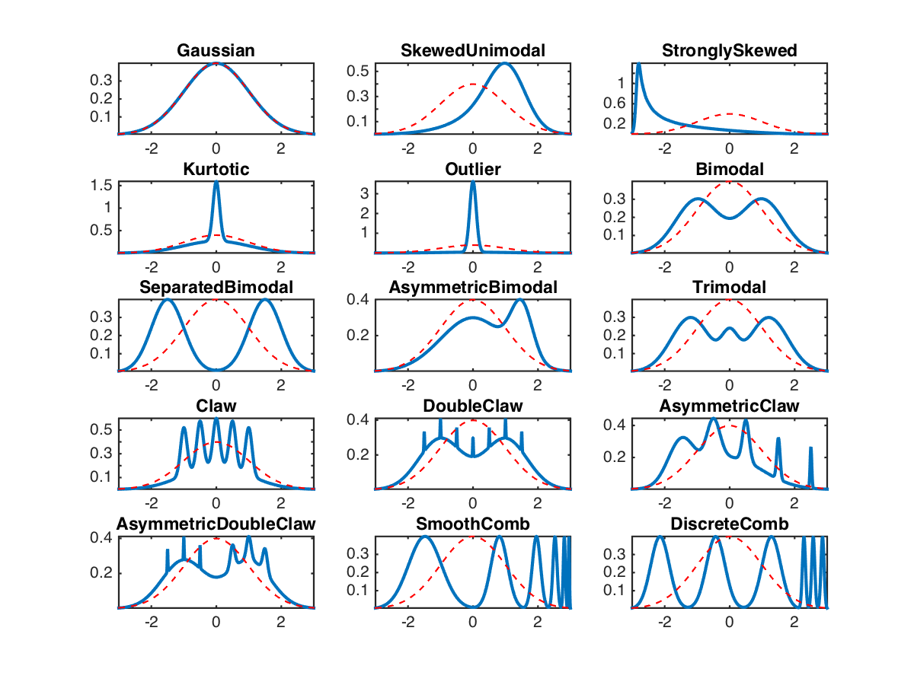
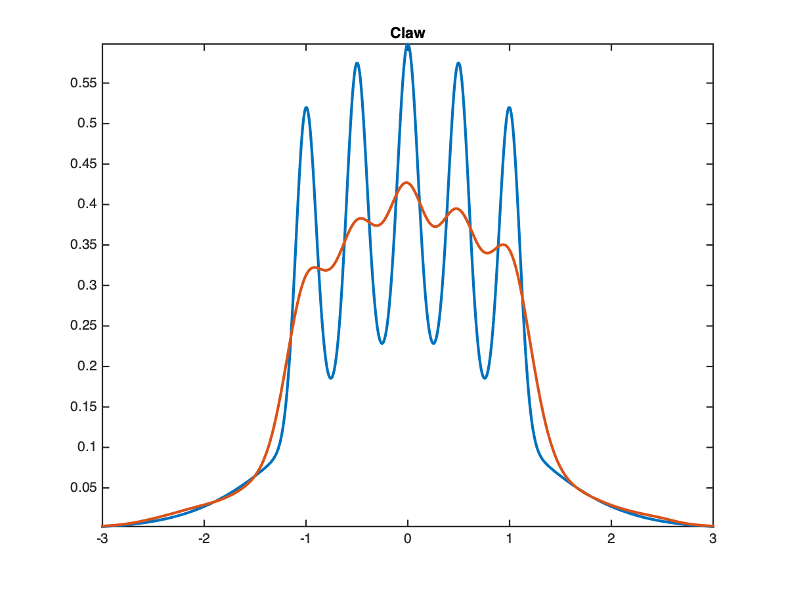

MakeDensity
=============

Normal Mixture Models for density estimation, clustering algorithms or bump hunting research and teaching purposes; providing the widely used Marron-Wand densities.



<a id="MarronWand"/> J. S. Marron. and  M. P. Wand. **Exact Mean Integrated Squared Error**.The Annals of Statistics, 20, 1992.

Getting Started
---------------

Here is an example of kernel density estimation using a rule-of-thumb bandwidth estimator
```matlab
T = 1000;
n = 5000;
name = 'Claw';
[pdfx,x,t] = MakeDensity(name,T,n);
[y,~] = kernelest(x,t);
figure
plot(t,pdfx,t,y,'linewidth',2);axis tight
title(name)
```

